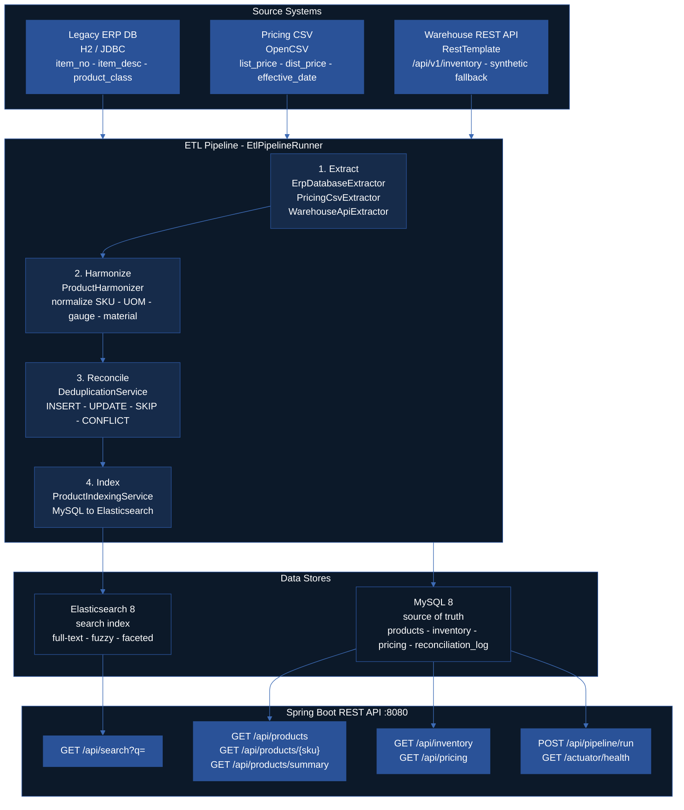
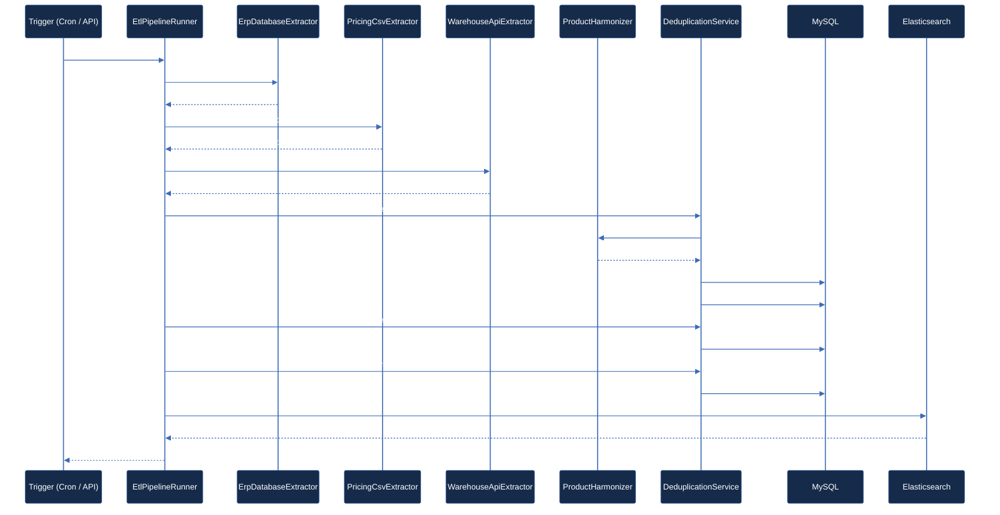
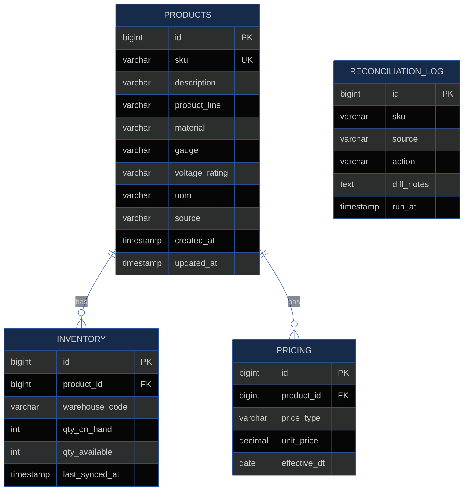

# KingWire Pipeline Demo

A backend data pipeline and REST API demonstrating extraction, harmonization, and centralized serving of product catalog data - built as an independent technical validation project.

---

## Assessment Response

This project directly addresses KingWire's two-part technical assessment:

### Requirement 1 - Data Extraction & Harmonization

> *"Evidence of a pipeline extracting, transforming, and reconciling data from disparate databases into a centralized datastore."*

KingWire's operational reality is a common enterprise problem: product, pricing, and inventory data living in separate systems that were never designed to talk to each other. This project models that exact environment:

| Source | Simulates | Technology | Key Challenge |
|---|---|---|---|
| Legacy ERP (H2) | On-premise Epicor/SAP item master | JdbcTemplate | Inconsistent column names, abbreviated material codes (`AL`, `CU`), non-normalized UOM values (`FEET`, `RL`) |
| Pricing CSV | Weekly Excel export from pricing team | OpenCSV | Manual file drops, no schema enforcement, malformed rows |
| Warehouse API | WMS REST inventory feed | RestTemplate | External dependency, unreachable in some environments |

Rather than writing one-off scripts per source, the pipeline establishes a repeatable, auditable pattern:

1. **Each source has a dedicated extractor** - isolated, independently testable, swappable without touching the rest of the pipeline
2. **All sources funnel into a single `RawProductRecord`** - a canonical intermediate format that absorbs schema differences before transformation
3. **`ProductHarmonizer` normalizes every inconsistency** - SKU casing, gauge suffixes (`2/0 AWG` → `2/0`), UOM variants, material inference from description when the field is absent
4. **`DeduplicationService` reconciles by natural key** - every run produces an INSERT / UPDATE / SKIP / CONFLICT decision per record, written to `reconciliation_log` for full auditability
5. **Flyway manages schema versioning** - the central MySQL datastore evolves through versioned migrations, not manual DDL

This directly replaces the spreadsheet-based reconciliation workflow described in KingWire's job description - the pipeline runs nightly at 2AM and can be triggered manually via `POST /api/pipeline/run`.

---

### Requirement 2 - Dynamic Data Serving

> *"Evidence of a middleware or API construction designed to serve that centralized data to a front-end database, with the associated performance considerations."*

The Spring Boot REST API sits between the centralized MySQL datastore and any front-end consumer. It is not a thin CRUD wrapper - it makes deliberate performance decisions at every layer:

| Consideration | Implementation | Why |
|---|---|---|
| **Connection pooling** | HikariCP with explicit `maximumPoolSize`, `connectionTimeout`, `idleTimeout`, `maxLifetime` | Prevent pool exhaustion under concurrent load; rotate connections before MySQL server timeout |
| **Query optimization** | `JOIN FETCH` on detail endpoints; indexed columns on all filter fields | Eliminate N+1 queries; push filtering to the DB layer where indexes apply |
| **Caching** | Caffeine in-process cache on `/api/products/summary` (10-min TTL) | Aggregate GROUP BY across a full product catalog is expensive; result doesn't need real-time freshness |
| **Pagination** | Spring `Pageable` on every list endpoint | No unbounded result sets; front end controls page size |
| **Full-text search** | Elasticsearch with multi-field fuzzy query | Product specs like "600V aluminum 2/0" span multiple fields; MySQL `LIKE` on TEXT columns is a sequential scan at scale |
| **Cache invalidation** | `@CacheEvict` fires after every pipeline run | Ensures the API reflects fresh data immediately after a sync without requiring a restart |

The Elasticsearch layer specifically addresses KingWire's product catalog use case - distributors and contractors search by partial specs across voltage, gauge, and material simultaneously. That query pattern is impractical in SQL and native to Elasticsearch.

---

### Requirement 3 - Solo Execution

> *"Demonstrate your capacity to build a backend data pipeline and a data-serving application layer without reliance on a supporting engineering team."*

The commit history is the evidence. 25 granular commits build the project from an empty repository to a fully functional system in a logical sequence - infrastructure first, data model second, extraction layer third, transformation fourth, API fifth, tests sixth, documentation last. Each commit is independently reviewable and represents a discrete, deliberate engineering decision. No commit does more than one thing.

The `DECISIONS.md` documents nine architectural tradeoffs made independently - technology selections, pattern choices, and the explicit reasoning behind each one. This is the working record of solo technical ownership.

---

---

## Architecture



---

## ETL Pipeline Flow



---

## Data Model



---

## Stack

| Layer | Technology | Purpose |
|---|---|---|
| Language | Java 17 | |
| Framework | Spring Boot 3.2.5 | Web, JPA, Cache, Scheduling |
| Primary DB | MySQL 8 | Central harmonized datastore (source of truth) |
| Legacy Source | H2 Embedded | Simulates on-premise ERP replica |
| Search | Elasticsearch 8.13 | Full-text product search index |
| Visualisation | Kibana 8.13 | Index exploration (dev tool) |
| Cache | Caffeine | In-process TTL cache for aggregate queries |
| Connection Pool | HikariCP | Explicit pool tuning for MySQL |
| Migrations | Flyway | Versioned schema management |
| CSV Parsing | OpenCSV | Pricing flat-file extraction |
| ORM | Hibernate / Spring Data JPA | Central MySQL read/write |
| Build | Maven | Dependency management |
| Container | Docker Compose | Local environment orchestration |

---

## Java Spring vs Python

### Type Safety at the Data Boundary

The harmonizer is doing the most dangerous work in the system - taking loosely structured data from three sources with inconsistent field types and coercing it into a strict schema. Java's compile-time type system catches mismatches before runtime. A Python dict can silently carry the wrong type all the way to the database insert. A Java `RawProductRecord` with a `BigDecimal unitPrice` field will not compile if you try to assign a string to it.

### Spring Data JPA vs Python ORMs

The JOIN FETCH queries, `Pageable` pagination, and projection interfaces (`ProductSummaryProjection`) are built into Spring Data JPA. The equivalent in Python's SQLAlchemy requires significantly more manual wiring, and Django ORM's pagination is tied to the Django request cycle - awkward to use in a standalone pipeline context.

### HikariCP

HikariCP is the fastest JDBC connection pool available and is Spring Boot's default. Python's database connection pooling (SQLAlchemy's pool, psycopg2's connection pool) is functional but HikariCP has had years of production hardening specifically for high-throughput JVM workloads. For a system serving concurrent API requests against MySQL, that matters.

### Spring Boot Auto-Configuration

The entire application - two datasources, Flyway migrations, Elasticsearch client, Caffeine cache, scheduled cron, actuator health endpoints - starts up from `application.yml` with virtually no boilerplate. Replicating the same in Python requires manually wiring together Flask/FastAPI, SQLAlchemy, Celery or APScheduler, and separate health check logic. Each of those has its own configuration model and failure mode.

### Dependency Injection

The pipeline architecture relies heavily on DI - `EtlPipelineRunner` receives its extractors, harmonizer, dedup service, and indexing service as constructor-injected beans. Spring's container manages their lifecycle. In Python, this pattern is achievable with frameworks like `dependency-injector`, but it is a third-party add-on with limited adoption compared to Spring's mature, deeply integrated DI container.

### Enterprise Credibility

KingWire is an industrial manufacturer with an existing ERP, on-premise systems, and a Microsoft Azure environment. That stack implies an IT organization that expects Java or .NET for backend services - not because Python is wrong, but because Java's tooling around monitoring (Actuator, JMX), deployment (JAR packaging, Docker), and long-term maintainability aligns with what enterprise operations teams already know how to support.

### Where Python Would Actually Win

To be direct about the tradeoffs: Python would be faster to prototype, easier to write quick data transformations with pandas, and far simpler if this were a pure ETL script rather than a full application. If KingWire had asked for a one-off migration script, Python would be the better choice. The reason Java wins here is that this is a running service - it has an API layer, a cache, a scheduler, connection pooling, and health checks. That is Spring's native territory.

---

## Quick Start

**Prerequisites:** Docker Desktop, Java 17, Maven 3.9+

```bash
# 1. Clone and build
git clone https://github.com/TannerAbraham/kingwire-pipeline-demo
cd kingwire-pipeline-demo

# 2. Start MySQL + Elasticsearch + Kibana
docker-compose up mysql elasticsearch kibana -d

# 3. Wait ~15 seconds for services to be healthy, then run the app
mvn spring-boot:run

# 4. Trigger the ETL pipeline (seeds all data)
curl -X POST http://localhost:8080/api/pipeline/run

# 5. Query the API
curl "http://localhost:8080/api/products?productLine=Aluminum+XHHW&size=5"
curl "http://localhost:8080/api/search?q=aluminum+2/0+600v"
curl "http://localhost:8080/api/products/summary"

# Kibana index explorer
open http://localhost:5601
```

Or run everything in Docker:
```bash
docker-compose up --build
```

---

## API Routes

| Method | Endpoint | Description | Data Source | Cached |
|---|---|---|---|---|
| `GET` | `/api/products` | Paginated product catalog. Filterable by `productLine`, `material`, `source` | MySQL | No |
| `GET` | `/api/products/{sku}` | Single product with full inventory and pricing detail (JOIN FETCH) | MySQL | No |
| `GET` | `/api/products/summary` | Aggregate product counts grouped by source and product line | MySQL | 10 min |
| `GET` | `/api/inventory` | Inventory levels across all warehouses. Filterable by `warehouse` | MySQL | No |
| `GET` | `/api/inventory/warehouses` | List of distinct warehouse codes (CHI, ATL, DAL, DEN, LAX) | MySQL | No |
| `GET` | `/api/pricing` | Pricing records. Filterable by `type` (LIST, DISTRIBUTOR) | MySQL | No |
| `GET` | `/api/search?q=` | Full-text fuzzy search across description, gauge, product line, material | Elasticsearch | No |
| `GET` | `/api/search/by-line` | Browse by exact product line | Elasticsearch | No |
| `GET` | `/api/search/by-material` | Browse by material (Aluminum, Copper) | Elasticsearch | No |
| `POST` | `/api/pipeline/run` | Manually trigger a full ETL pipeline run | - | Evicts all |
| `GET` | `/actuator/health` | Application and dependency health check | - | No |
| `GET` | `/actuator/metrics` | JVM, HikariCP pool, and cache metrics | - | No |
| `GET` | `/actuator/caches` | Inspect active Caffeine cache entries | - | No |

---

## Spring Application Architecture

```mermaid
%%{init: {"theme": "base", "themeVariables": {"primaryColor": "#162B4A", "primaryTextColor": "#FFFFFF", "primaryBorderColor": "#2A5298", "lineColor": "#3D6BB5", "secondaryColor": "#0C1929", "tertiaryColor": "#0C1929", "clusterBkg": "#0C1929", "clusterBorder": "#2A5298", "titleColor": "#FFFFFF", "edgeLabelBackground": "#162B4A", "nodeTextColor": "#FFFFFF"}}}%%
flowchart TB
    subgraph CLIENT["Client / Front End"]
        FE["HTTP Requests"]
    end

    subgraph CONTROLLER["Controller Layer - com.kingwiredemo.api"]
        PC["ProductController\nPagination - Filtering - Caching"]
        IC["InventoryController\nWarehouse filtering"]
        PRC["PricingController\nPrice type filtering"]
        SC["SearchController\nFull-text - Fuzzy - Faceted"]
        PLC["PipelineController\nManual ETL trigger"]
    end

    subgraph SERVICE["Service Layer - com.kingwiredemo.pipeline - transform - search"]
        RUNNER["EtlPipelineRunner\nOrchestrates all ETL phases\n@Scheduled nightly 2AM\nAtomicBoolean concurrency guard"]
        HARM["ProductHarmonizer\nNormalizes SKU - UOM - gauge\nInfers material from description"]
        DEDUP["DeduplicationService\nINSERT - UPDATE - SKIP - CONFLICT\nWrites reconciliation_log audit trail"]
        INDEX["ProductIndexingService\nFull reindex MySQL to Elasticsearch\nRuns after every pipeline completion"]
    end

    subgraph EXTRACTOR["Extraction Layer - com.kingwiredemo.extractor"]
        ERP["ErpDatabaseExtractor\nJdbcTemplate to H2 legacy ERP\nMaps ERP item_master columns"]
        CSV["PricingCsvExtractor\nOpenCSV to pricing-export.csv\nLenient row-level error handling"]
        WH["WarehouseApiExtractor\nRestTemplate to WMS REST API\nSynthetic fallback if unreachable"]
    end

    subgraph REPO["Repository Layer - com.kingwiredemo.repository"]
        JPA["Spring Data JPA\nProductRepository - InventoryRepository\nPricingRepository - ReconciliationLogRepository\nJOIN FETCH - Projections - Pageable"]
        ESR["ElasticsearchRepository\nProductSearchRepository\nMulti-field query with AUTO fuzziness"]
    end

    subgraph CONFIG["Configuration - com.kingwiredemo.config"]
        DS["DataSourceConfig\nHikariCP pool tuning\nPrimary MySQL + Legacy H2 datasources"]
        CC["CacheConfig\nCaffeine - 10min summary TTL\n5min product detail TTL"]
    end

    subgraph DATA["Data Layer"]
        MYSQL[("MySQL 8\nSource of truth\nproducts - inventory\npricing - recon_log")]
        ES[("Elasticsearch 8\nSearch index\nProductDocument")]
        H2[("H2 Embedded\nLegacy ERP replica\nerp_item_master")]
    end

    classDef client fill:#2A5298,stroke:#0C1929,color:#FFFFFF
    classDef controller fill:#162B4A,stroke:#2A5298,color:#FFFFFF
    classDef service fill:#1A3560,stroke:#2A5298,color:#FFFFFF
    classDef extractor fill:#162B4A,stroke:#2A5298,color:#FFFFFF
    classDef repo fill:#0C1929,stroke:#2A5298,color:#FFFFFF
    classDef config fill:#243D6B,stroke:#2A5298,color:#FFFFFF
    classDef data fill:#2A5298,stroke:#0C1929,color:#FFFFFF

    class FE client
    class PC,IC,PRC,SC,PLC controller
    class RUNNER,HARM,DEDUP,INDEX service
    class ERP,CSV,WH extractor
    class JPA,ESR repo
    class DS,CC config
    class MYSQL,ES,H2 data

    FE --> CONTROLLER
    CONTROLLER --> SERVICE
    CONTROLLER --> REPO
    SERVICE --> EXTRACTOR
    SERVICE --> REPO
    EXTRACTOR --> H2
    REPO --> MYSQL
    REPO --> ES
    CONFIG -.->|configures| REPO
    CONFIG -.->|configures| SERVICE
    CONFIG -.->|configures| EXTRACTOR
```



---

## Performance Design Decisions

### HikariCP Pool Tuning (DataSourceConfig.java)
```
maximumPoolSize = 10     Handles concurrent API requests without over-provisioning
minimumIdle = 2          Keeps warm connections available without waste
connectionTimeout = 30s  Fail fast on pool exhaustion - surface problems quickly
idleTimeout = 10min      Reclaim idle connections in low-traffic windows
maxLifetime = 30min      Rotate connections before MySQL's wait_timeout (8h)
```

### Caching (CacheConfig.java)
- `productSummary` (10-min TTL): GROUP BY aggregate across full catalog - expensive, not real-time critical
- `productDetail` (5-min TTL): JOIN-loaded product with inventory and pricing
- Both caches evicted via `@CacheEvict` on pipeline completion

### Database Indexes (V1__create_schema.sql)
All filter columns are indexed: `product_line`, `source`, `material`, `warehouse_code`, `price_type`, `sku` (unique)

### Pagination
All list endpoints use Spring `Pageable` - no unbounded result sets returned

### Elasticsearch Full-Text Search
Multi-field fuzzy search with description field boosted 2x. Handles spec abbreviation
variants (XHHW/XHWW, "2/0 AWG"/"2/0") that would require complex LIKE chains in MySQL.

---

## Project Structure

```
kingwire-pipeline-demo/
├── docker-compose.yml
├── Dockerfile
├── README.md
├── DECISIONS.md
├── pom.xml
└── src/
    ├── main/java/com/kingwiredemo/
    │   ├── KingwireDemoApplication.java
    │   ├── config/
    │   │   ├── DataSourceConfig.java       HikariCP + legacy H2 datasource
    │   │   └── CacheConfig.java            Caffeine TTL configuration
    │   ├── extractor/
    │   │   ├── ErpDatabaseExtractor.java   JdbcTemplate → legacy ERP
    │   │   ├── PricingCsvExtractor.java    OpenCSV → pricing-export.csv
    │   │   └── WarehouseApiExtractor.java  RestTemplate → warehouse API
    │   ├── transform/
    │   │   ├── ProductHarmonizer.java      Normalize across all sources
    │   │   └── DeduplicationService.java   Reconcile into MySQL
    │   ├── pipeline/
    │   │   └── EtlPipelineRunner.java      Orchestrate all phases
    │   ├── search/
    │   │   └── ProductIndexingService.java MySQL → Elasticsearch sync
    │   ├── api/
    │   │   ├── ProductController.java
    │   │   ├── InventoryController.java
    │   │   ├── PricingController.java
    │   │   ├── SearchController.java
    │   │   └── PipelineController.java
    │   ├── model/
    │   │   ├── entity/                     JPA entities (Product, Inventory, Pricing, ReconciliationLog)
    │   │   ├── dto/                        RawProductRecord, ProductResponseDto, PipelineResultDto
    │   │   └── search/                     ProductDocument (ES mapping)
    │   └── repository/                     JPA + ES repositories
    └── main/resources/
        ├── application.yml
        ├── data/pricing-export.csv
        └── db/
            ├── migration/V1__create_schema.sql    (Flyway - MySQL)
            └── legacy/
                ├── V1__legacy_erp_schema.sql      (H2 seed)
                └── V2__legacy_erp_seed.sql
```
